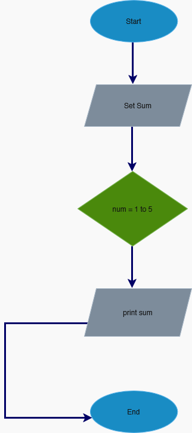
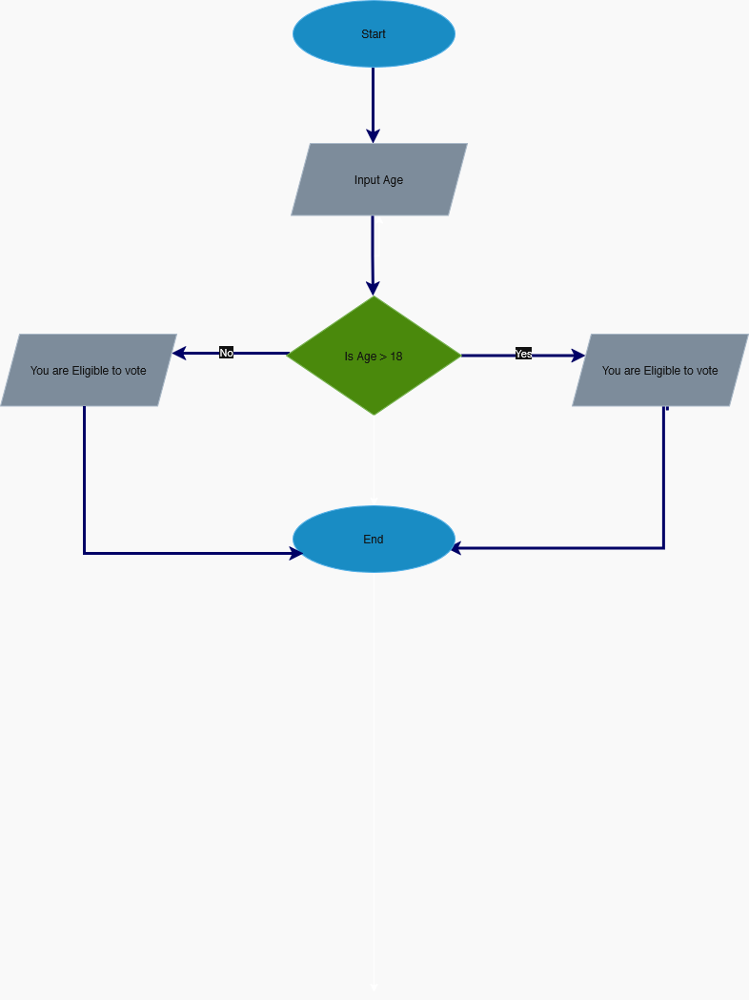
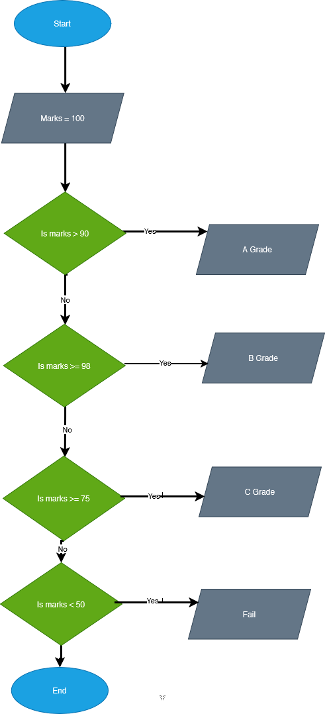
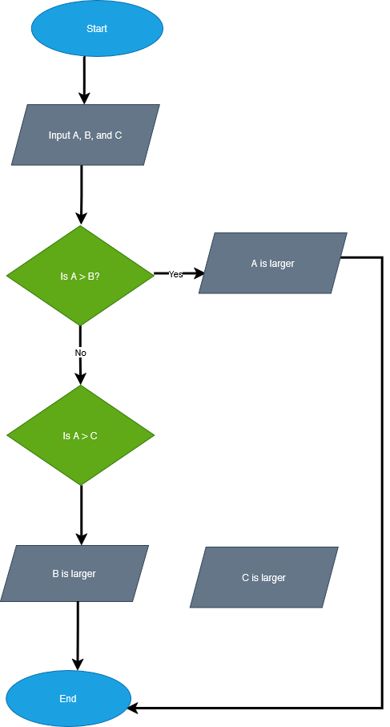

# Exercise-Algorithm-Flowchart-Draw-io

## Exercise 1

.png)

## Exercise 2
A program that:

    Prompts user to enter 5 numbers
    Keeps a running total
    Displays the sum
    Ends program

✔ Pseudocode

    START
        total = 0
        REPEAT 5 TIMES
            INPUT number
            total = total + number
        ENDREPEAT
        PRINT "Total sum = ", total
    END

## Exercise 3

A program asks the user to enter their age.

    If age is 18 or older, display: "You are eligible to vote."
    If age is less than 18, display: "You are not eligible to vote."
    End the program.

✔ **Pseudocode** 

    START
        INPUT age
        IF age >= 18 THEN
            PRINT "You are eligible to vote."
        ELSE
            PRINT "You are not eligible to vote."
        ENDIF
    END

✔ **Flowchart**

